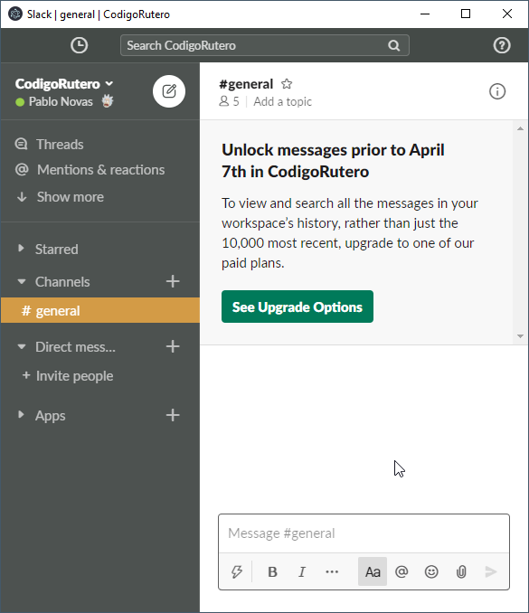
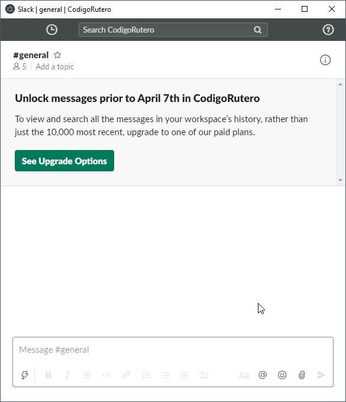

# slack-sidebar

This is a quick Slack wrapper to hack a toggle visibility for the sidebar.

## why

I just want to only see chat history of the current channel but the space of my screen is short so a side bar, which I don't use a lot is pretty annoying and space consumer.<br/>

Opening it using chrome or other browser requires to be executing a script every time, also I don't like to have more than one window for each browser just for slack.

## how to

Requirements:

- Electron 9.0.0
- Node 12.14.1
- Chromium 83.0.4103.64

```bash
npm install
```

Run it as it is the first time (no params) so you will login into slack and store the session.

```bash
npm start
```

Then run it with your workspace as param:

```bash
WORKSPACE=fun_with_friends npm start
```

That will lift up slack site and use your cookies so it's up like the app.

Wanna dev tools?, run it as:
```bash
NODE_ENV=development WORKSPACE=fun_with_friends npm start
```

Then you can toggle sidebar with `Ctrl+Tab` or `Command+Tab` (you must focus on slack first)



